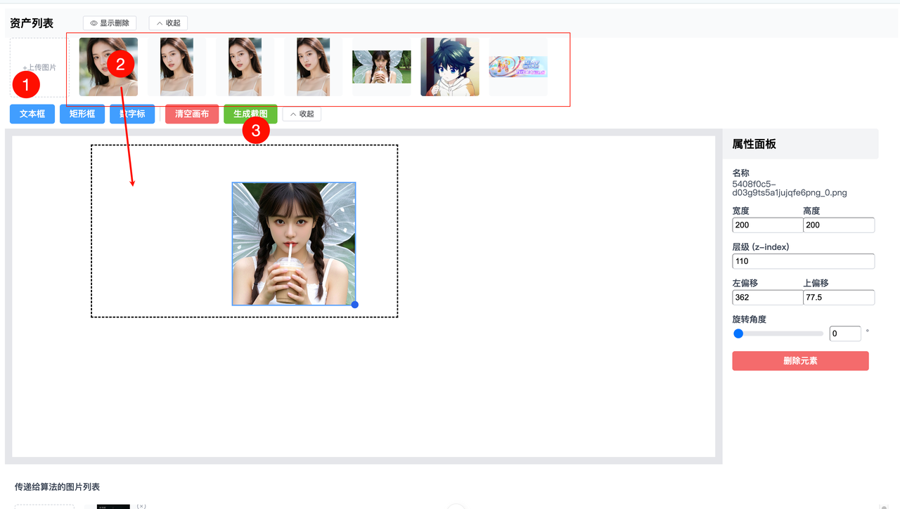
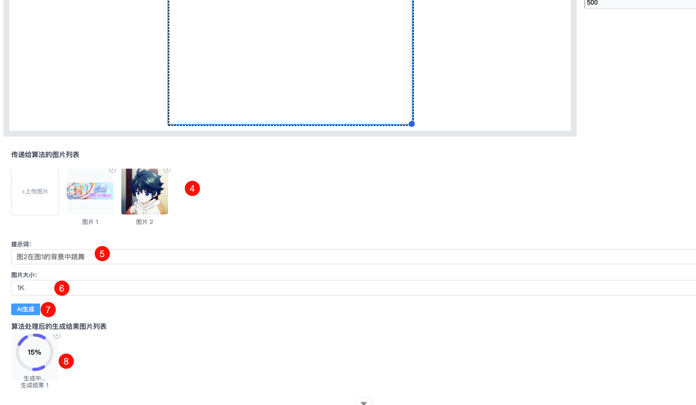
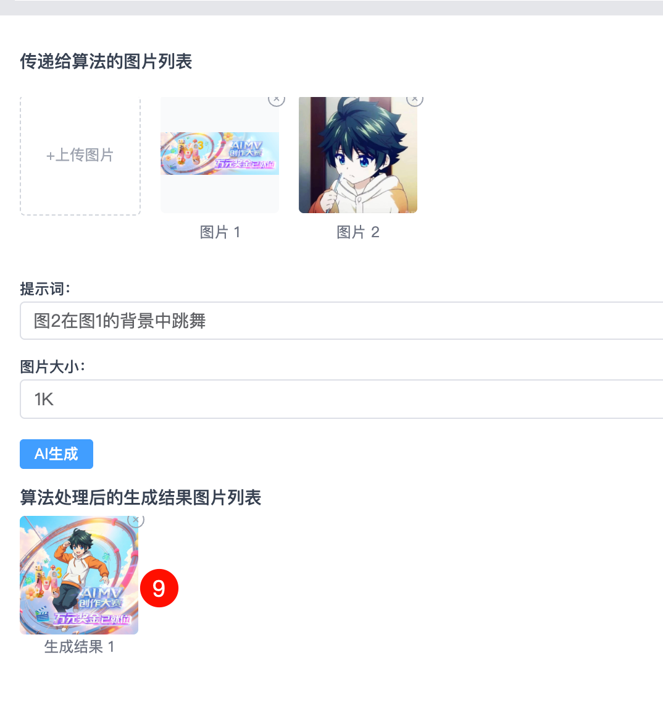
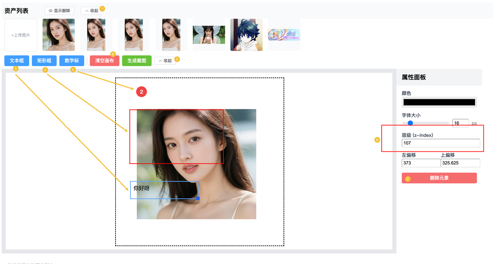
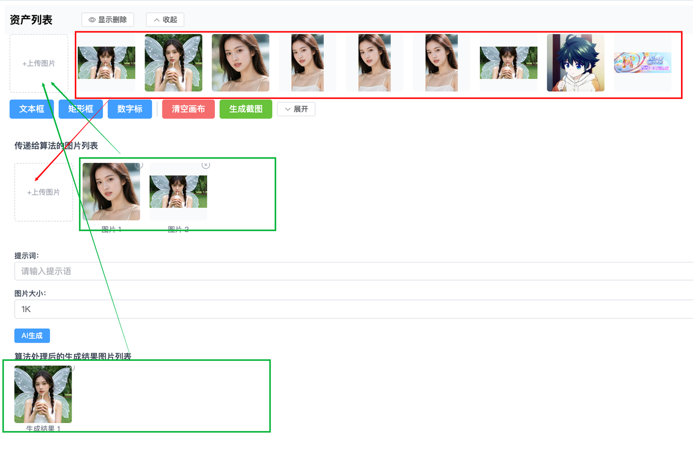

# 2D画布交互，AIGC生图

## 技术栈

vue3+ts+router+pinia+element-plus+unocss+ts+自动导入API等

## 项目运行

```sh
pnpm i
pnpm dev
pnpm build
```

## 2D画布交互

访问地址：http://localhost:5173/ （持续迭代中，有问题请联系 @菲鸽 ）
一、主流程交互



- 1）① 上传自己要处理的素材，②把素材拖入到画布，③点击“生成截图”，得到的截图会到④区域，④区域也支持直接上传素材。【截图只会截虚线框的区域，虚线框可以设置不同的大小和比例1:1,16:9,9:16,4:3,3:4】
- 2）⑤填写提示词，⑥选择图片大小，⑦点击“AI生成”按钮，则会在⑧中进行轮询。
- 3） 最终结果如下图 ⑨ 所示
  
  二、其他流程交互
  
- 1）①②都是支持展开收起的，③④⑤都可以点击然后在画布上生成对应的工具，右侧的属性面板可以调整属性，其中⑥z-index是调整层级，⑦是删除该元素，⑧是清空画布。
  
- 2）不同区域的素材支持相互拖拽。方便用户把截图和生成好的图加入到资产中。
